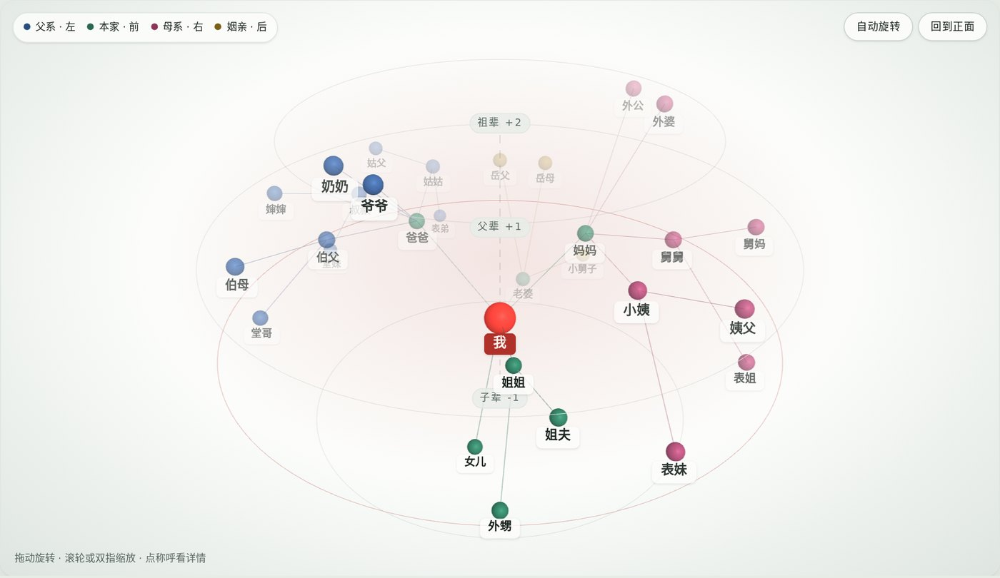

# 家族辈分谱

以「我」为中心的家族辈分谱：把亲戚按辈分和「爸爸家 / 自家 / 妈妈家 / 配偶那边」排好，自动算出该怎么称呼，还能用 3D 关系图看一家人是怎么连起来的。适合过年走亲戚前认人，也适合给孩子讲清楚家里谁是谁。


## 怎么用

**在线用（不用下载）**：打开本仓库首页右侧「About」里的网址。

**下载到电脑用（Windows）**：

1. 在本仓库右侧「Releases」下载最新的 `家族辈分谱-v*.zip`，解压到任意位置。
   也可以点绿色的「Code」按钮 →「Download ZIP」，下载整个仓库。
2. 双击 `启动家族辈分谱.bat`，会用 Edge 或 Chrome 打开一个独立窗口。
   也可以直接双击 `家族辈分谱.html`，用任何浏览器打开（Mac、Linux 也可以）。
3. 想在桌面放一个图标：双击 `创建桌面快捷方式.bat`。

不需要安装任何软件，断网也能用（3D 图用到的 `three.min.js` 已经放在文件夹里）。

> 第一次双击 .bat 时，Windows 可能提示「Windows 已保护你的电脑」，这是因为文件是从网上下载的。点「更多信息」→「仍要运行」即可；也可以直接双击 `家族辈分谱.html`。

## 能做什么

- **辈分表**：从上到下按辈分排，左右分爸爸家、自家、妈妈家、配偶那边；夫妻成对显示。
- **自动称呼**：伯父、姑父、舅妈、堂哥、表妹、岳父、小舅子……填上出生年份，就能分清堂哥和堂弟。
- **双向称呼**：点开任何一位，都能看到你该叫 TA 什么、TA 叫你什么、差几辈。
- **换个角度看**：切换到任何一位亲人，看 TA 该怎么称呼大家（比如给孩子看）。
- **3D 关系图**：你在正中间，亲人按关系一层层向外延伸，可以拖动旋转、缩放。
- **称呼计算器**：没录进家谱的亲戚，也能按「妈妈 → 哥哥 → 女儿」一步步点出来。
- **字辈**：给每一辈标上名字里共用的字。




## 填写自己的家人

打开后看到的是一份虚构的示例家谱。点「编辑家谱」→「清空示例，从我开始」，先填自己，再用「＋ 添加亲属」一个个往外加（TA 是某某的父亲 / 哥哥 / 女儿……）。

**你填的内容只保存在你自己的浏览器里**，不会上传到任何地方，别人看不到。换电脑或清理浏览器数据前，在「设置与备份」里复制备份数据存好，之后可以原样导入。

## 文件说明

| 文件 | 作用 |
|---|---|
| `家族辈分谱.html` | 网页本体，双击就能打开（由 `build.py` 生成） |
| `index.html` | 在线版入口，会自动跳到 `家族辈分谱.html` |
| `启动家族辈分谱.bat` | Windows 启动器：用 Edge / Chrome 的独立窗口打开网页 |
| `创建桌面快捷方式.bat` | 在桌面放一个带「谱」字印章图标的快捷方式 |
| `tools/` | 启动器脚本（`launch.ps1`、`make-shortcut.ps1`）和图标 `family.ico` |
| `three.min.js` | 3D 图用的图形库，没网时也能用 |
| `src/` | 源码：`engine.js` 称呼推算、`g3d.js` 3D 关系图、`app.js` 页面、`head.html` 样式、`data.json` 示例数据 |
| `build.py` | 把 `src/` 拼成 `家族辈分谱.html` |

## 自己改代码

改完 `src/` 里的文件后，运行：

```
python build.py
```

会重新生成 `家族辈分谱.html`（顺带生成的 `dist/artifact.html` 是 claude.ai 在线页面用的版本，可以不管）。

`src/data.json` 里每个人的字段：`id` 编号、`name` 姓名、`g` 性别（M/F）、`yr` 出生年份、`note` 备注、`fa` 父亲的 id、`mo` 母亲的 id、`sp` 配偶的 id、`ph` 为 true 时表示自动补的占位。`root` 是「我」的 id，`zibei` 是字辈（键是相对「我」的辈分，比如 `"1"` 是父辈）。

## 说明

称呼按普通话里最常见的叫法推算，各地习惯不同（比如姥爷 / 外公、姑妈 / 姑姑），以你家里的叫法为准。

## 许可

MIT，见 [LICENSE](LICENSE)。
